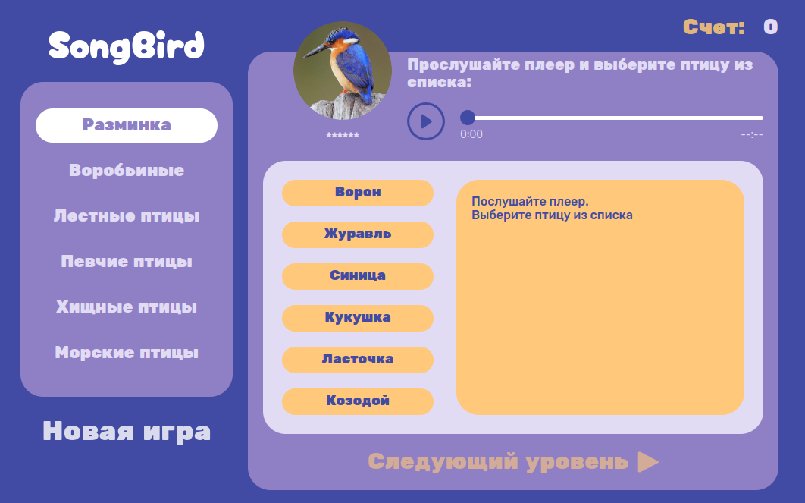

<h1 align="center">Songbird Quiz Game</h1>

  

 

> EN: Quiz game. You need to guess the bird by its song. You can play with friends and explore the animal world together. The application was developed as part of a training project in [RS School](https://rs.school). The design and layout of the application is individual.

> RU: Игра-викторина. Тебе необходимо угадать птицу по её пению. Ты можешь играть с друзьями и вместе познавать животный мир. Приложение разработано в рамках учебного проекта в [RS School](https://rs.school). Дизайн и компоновка приложения индивидуальны.

---
The application is based on the pure *JavaScript*.

Used for design:
- [Webpack](https://webpack.js.org/)
- [SCSS](https://sass-lang.com/)

---

### ✨ [Demo](https://school-record-book-rss.netlify.app/)

## Authors

👤 **Indar Basto**

* Github: [@wowblvck](https://github.com/wowblvck)